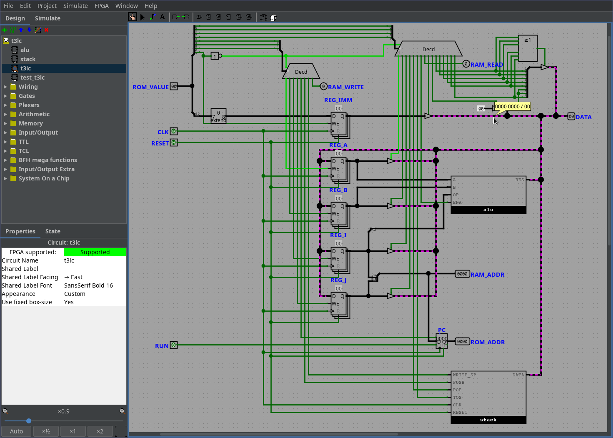

# t3lc

*Tiny Transport Triggered Logic CPU(t3lc)*

The t3lc is a simple transport-triggered CPU.
It has 4 registers and a single bus called DATA,
supports up to 256*16 bit ROM, and 256*8 bit RAM.

## CPU

See [T3LC.md](doc/T3LC.md).

The actual CPU is implemented as a LogiSim evolution circuit, in the
file [t3lc.circ](doc/t3lc.circ)

## Assembler

See [ASSEMBLER.md](doc/ASSEMBLER.md), and
[asm/hello.asm.lua](asm/hello.asm.lua)

# TODO

TODO: more instruction mnemonics
TODO: Write an emulator
