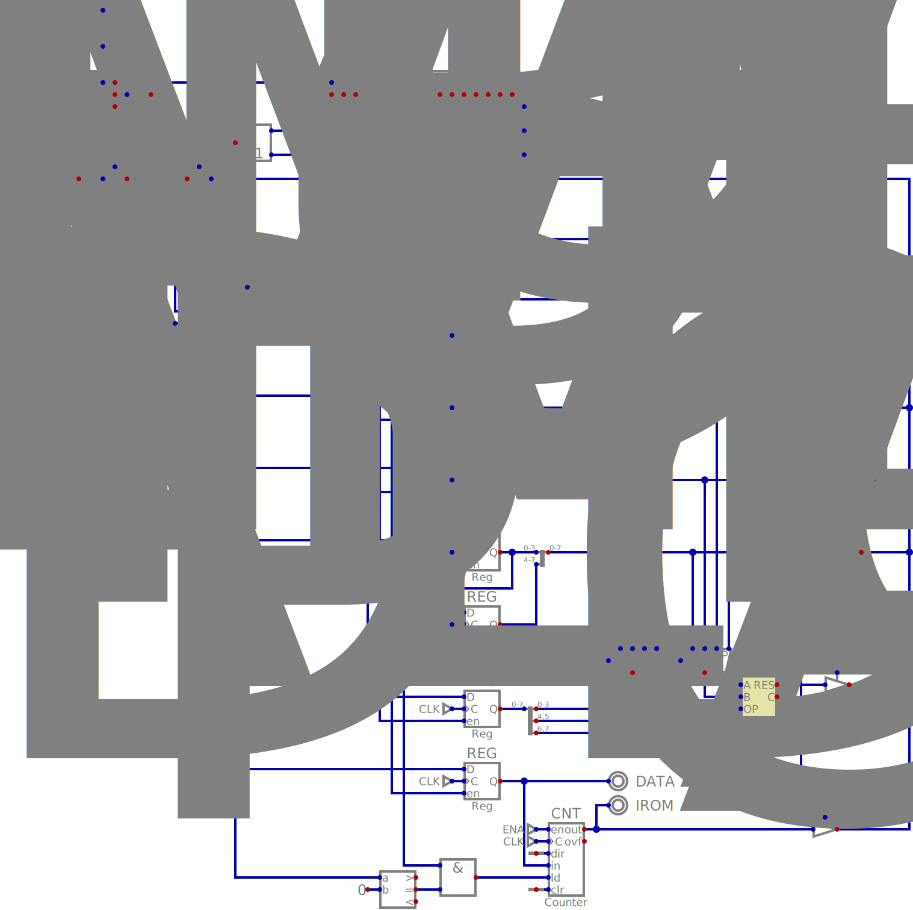

# t3lc

*Tiny Transport Triggered Logic CPU(t3lc)*

The t3lc is a set of 3 simple transport-triggered CPU designs
implemented using the [Digital](https://github.com/hneemann/Digital) logic simulator.

All variants share some similarities: same ALU implementation,
separate instruction/data storage(harvard architecture),
and use single 8-bit `DATA` bus that is controlled via an 8-bit `OP` read from ROM.

## t3lc_mini:

 - All busses and registers etc. are 8-bit
 - "registered" DATA bus(read and write in two instructions)
 - OP is 4-bit op-code, optional 4-bit op-imm value
 - 3 general-purpose 8-bit registers: `REG_A`, `REG_B`, `REG_C`
 - 8-bit shift register: `SREG_IMM`
   * two 4 bit-stages shifted from op-imm on read
 - 8-bit Address/branch register: `REG_ADDR`
   * address for DRAM read/write or DROM read
   * target for jumping/branching
 - 8-bit ALU control register: `REG_ALU`
   * 2-bit ALU source: `REG_A`, `REG_B`, `REG_C`, `SREG_IMM`
   * 2-bit ALU target: `REG_A`, `REG_B`, `REG_C`, `SREG_IMM`
   * 4-bit ALU op
 - 8-bit program counter: `CNT_PC`
   * is ROM address(256-byte instruction ROM)
   * can only be loaded from `REG_ADDR`

## t3lc_medium

(TODO: Currently only exists in LogiSim evolution circuit)

 - 8-bit registers with 16-bit address
 - "unregistered" `DATA` bus(read and write in one instruction)
 - OP is 7-bit op-imm value or 7-bit op-code
   * op-code is split into 4-bit source and 3-bit target
 - 2x general-purpose 8-bit 256-value register files: `REGF_A`, `REGF_B`
   * indexed from `DATA` bus
 - 2x general-purpose 8-bit 128-value register files: `REGF_I`, `REGF_J`
   * indexed from `REG_IMM`
 - 7-bit register loadeded from op-imm: `REG_IMM`
 - general-purpose 256-byte stack
 - ALU is controlled by `REG_IMM`
   * 4-bit ALU op
   * 3-bit ALU input select:
     - `REG_AF|REGF_B`, `REGF_B|REGF_A`, `REGF_I|REGF_J`, `REGF_J|REGF_I`
     - `CNT_PC_LO|CNT_PC_LO`, `CNT_PC_HI|CNT_PC_HI`, `TOS|REGF_A`, `REGF_A|TOS`
 - 16-bit program counter: `CNT_PC`
   * loaded from `REG_I` and `REG_J`

## t3lc_huge

 - "registered" DATA bus(read and write in two instructions)
 - OP is 7-bit op-imm value or 7-bit op-code
   * op-code is split into 5-bit op source/target and 2-bit op-group(special0, read, write, special1).
 - 4x general-purpose 8-bit 256-value register files: `REGF_A`, `REGF_B`, `REGF_I`, `REGF_J`
   * indexed from `DATA` bus
 - 21-bit shift-register loaded from op-imm: `SREG_IMM`
 - 2x general-purpose 256-byte stack
 - ALUs are controlled by `SREG_IMM`(21-bits)
   * 8-bit ALU
     - 4-bit ALU op
     - two 3-bit ALU operand selects
       * `REGF_A`, `REGF_B`, `REGF_I`, `REGF_J`
       * `STACK_X_TOS`, `STACK_Y_TOS`, `ALU_IMM`, `REGF_J`
     - 8-bit ALU immediate value `ALU_IMM`
   * 16-bit ALU
     - 4-bit ALU op
     - two 2-bit operand select
       * `REGF_AB`, `REGF_IJ`, `STACK_XY`, `CNT_PC`
     - result is latched by special instruction, available as two 8-bit values
 - flow control register: `REG_JUMP_CTRL`
   * 2-bit address select: `JUMP_IMM`, `REGF_AB`, `REGF_IJ`, `STACK_XY_TOS`
   * 6-bit address immediate: `JUMP_IMM`
 - 16-bit program counter: `CNT_PC`
   * loaded from address selected in flow control register
 - interrupt pin
   * when high with clock, load `JUMP_IMM` into `CNT_PC`

## ALU

The ALU is shared between the variants, and is available in two
versions: 8-bit and 16-bit.

It's output is simply the result of the operation applied to the
inputs A and B. All operations are unsigned.

Operations marked with a (*) also output a carry value.

| ALU op | Name    | Result
| ------ | ------- | ------
|   0000 |    ADD* | RES = A + B
|   0001 |    SUB* | RES = A - B
|   0010 |    MUL* | RES = A * B
|   0011 |    DIV* | RES = A / B
|   0100 |     AND | RES = A & B
|   0101 |      OR | RES = A | B
|   0110 |     XOR | RES = A ^ B
|   0111 |     NOT | RES = !A
|   1000 | LSHIFT1 | RES = A<<1
|   1001 |  LSHIFT | RES = A<<B
|   1010 | RSHIFT1 | RES = A>>1
|   1011 |  RSHIFT | RES = A>>B
|   1100 |     NEG | RES = -A
|   1101 |      GT | RES = A>B
|   1110 |      EQ | RES = A==B
|   1111 |       A | RES = A

## Stack

 - 256*8-bit values
 - supports 6 operations
   * increment/decrement SP(push/pop)
   * read/write TOS
   * read/write SP

## Register file

 - 256*8-bit values
 - supports 4 operations
   * read/write memory
   * read/write address
